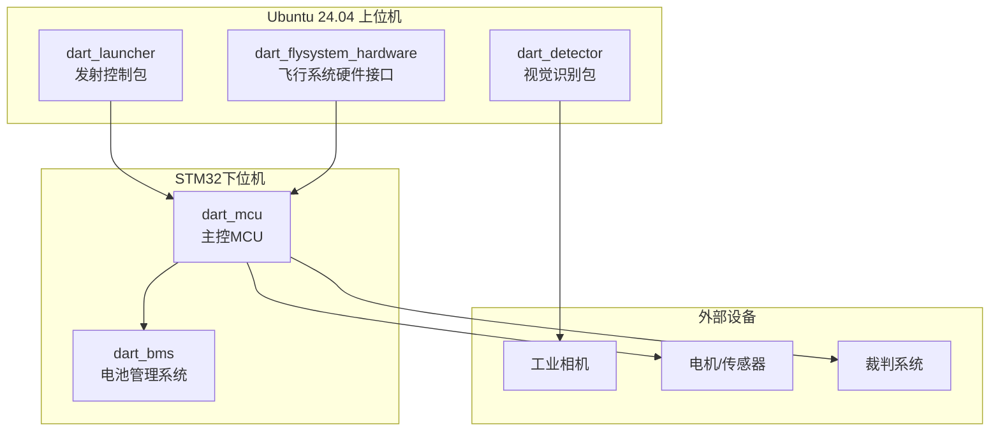
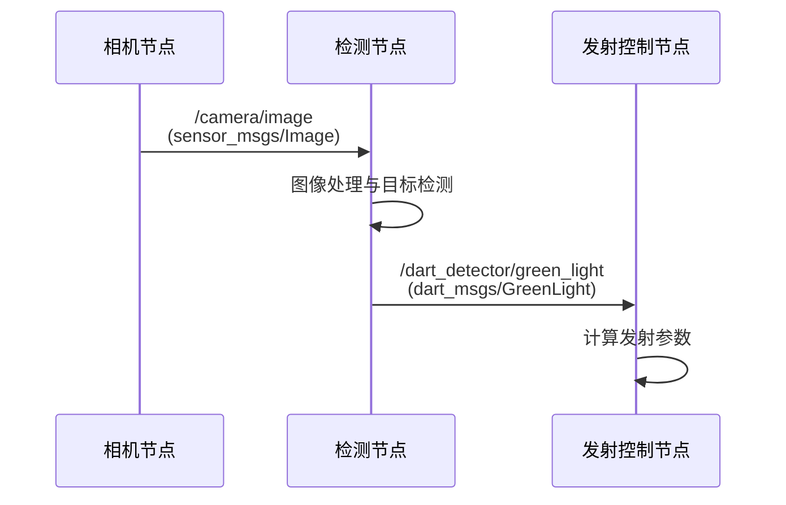
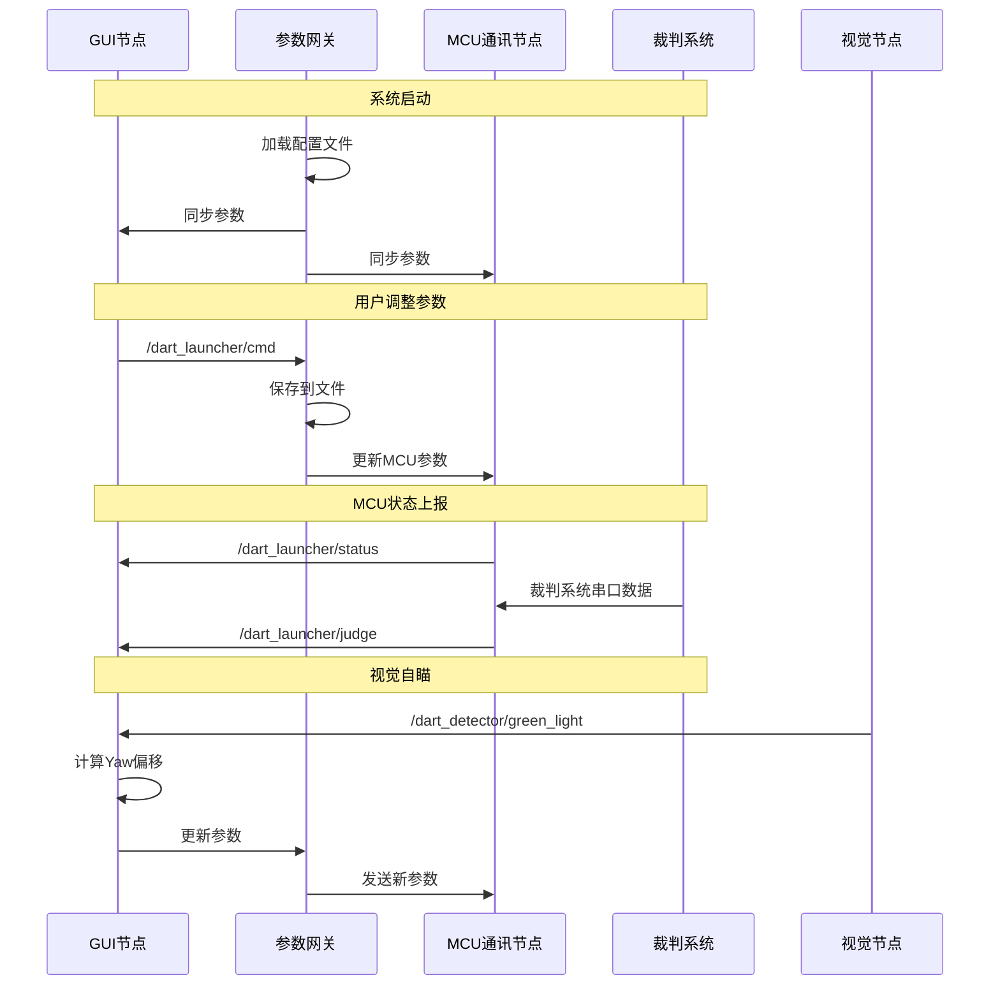
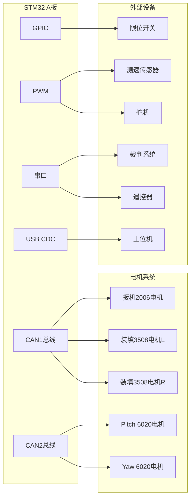
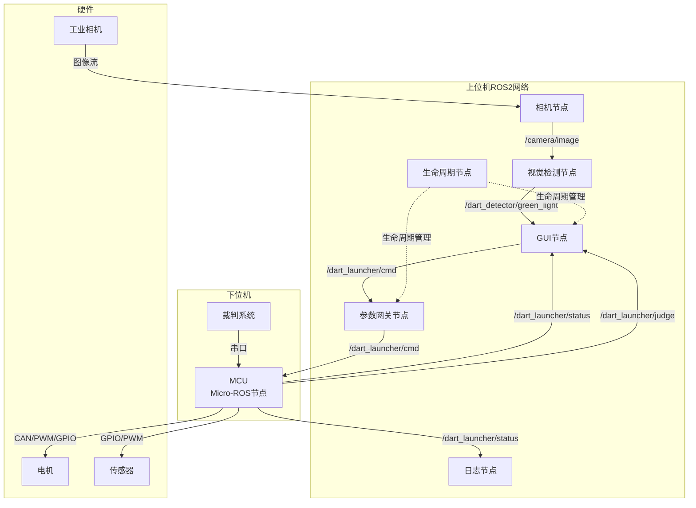
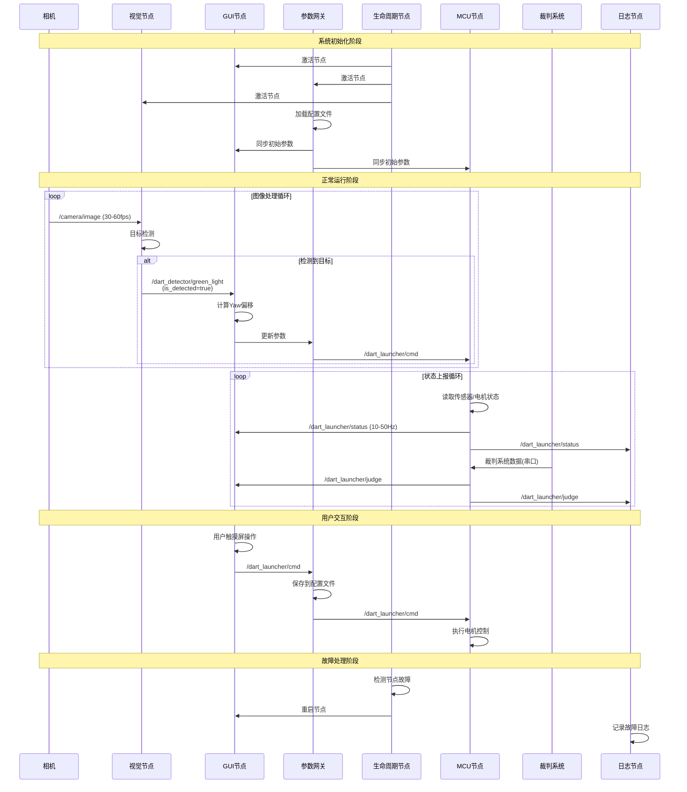

# 飞镖ROS2工作空间架构文档

## 目录
- [项目概述](#项目概述)
- [仓库结构](#仓库结构)
- [核心功能包](#核心功能包)
- [通信架构](#通信架构)
- [开发与部署](#开发与部署)

---

## 项目概述

本仓库是飞镖机器人的ROS2工作空间，包含了飞镖发射系统的所有软硬件控制代码。系统采用上下位机架构，上位机运行Ubuntu 24.04 + ROS2，下位机使用STM32微控制器。

### 系统架构图



---

## 仓库结构

### 根目录结构

```
dart-ros2-workspace/
├── src/                          # ROS2功能包源代码目录
│   ├── dart_detector/            # 视觉识别功能包
│   ├── dart_launcher/            # 发射控制功能包
│   ├── dart_flysystem_hardware/  # 飞行系统硬件接口
│   ├── dart_flysystem_description/ # 飞行系统描述文件
│   ├── dart_mcu/                 # 主控MCU固件(STM32)
│   ├── dart_bms/                 # 电池管理系统固件(STM32)
│   ├── dart_test/                # 测试功能包
│   ├── dart_comm_share/          # 通信共享库(submodule)
│   └── vision_opencv/            # OpenCV ROS2桥接(submodule)
├── scripts/                      # 工具脚本
│   ├── launch.sh                 # 启动脚本
│   ├── stop.sh                   # 停止脚本
│   ├── cross_compile.sh          # 交叉编译脚本
│   ├── setup_qemu_environment.sh # QEMU环境设置
│   ├── camera_control.sh         # 相机控制脚本
│   ├── fetch_music.sh            # 音乐文件下载脚本
│   └── toolchain.cmake           # 交叉编译工具链配置
├── bin/                          # 可执行文件
│   └── media-get-aarch64         # 媒体获取工具(ARM64)
├── music/                        # 音频文件资源
├── .vscode/                      # VSCode配置
├── .run/                         # JetBrains IDE运行配置
├── Dockerfile                    # Docker镜像构建文件
├── Dockerfile.reconstruct        # 依赖环境更新Dockerfile
├── README.md                     # 项目说明文档
├── 飞镖架电气拓扑.md              # 电气拓扑文档
├── log_reader.py                 # 日志读取工具
├── frequency_sweep_data.csv      # 频率扫描数据
└── system_identification_data.csv # 系统辨识数据
```

### 根目录文件说明

| 文件/目录 | 说明 |
|----------|------|
| `src/` | ROS2功能包源代码，包含所有软件模块 |
| `scripts/` | 各类工具脚本，用于编译、部署和调试 |
| `bin/` | 编译好的可执行文件，主要是ARM64架构的工具 |
| `music/` | 系统音频资源，用于状态提示音 |
| `Dockerfile` | Docker镜像构建文件，基于chenyuwuai/ros2_crosscompile |
| `飞镖架电气拓扑.md` | 详细的电气连接和状态机设计文档 |
| `log_reader.py` | Python日志分析工具 |
| `*.csv` | 系统调试和标定数据文件 |

---

## 核心功能包

### 1. dart_detector - 视觉识别功能包

**包路径**: `src/dart_detector/`

#### 功能概述
自瞄支持包是飞镖机器人的视觉识别功能模块，负责检测目标绿灯并计算目标的屏幕坐标，支持二维码扫描功能。

#### 目录结构
```
dart_detector/
├── camera_driver/          # 相机驱动
│   ├── DHCameraDriver/     # 大华工业相机驱动
│   └── LCCV/               # Raspberry Pi相机驱动(submodule)
├── config/                 # 配置文件
├── include/                # 头文件
│   ├── camera_hal/         # 相机硬件抽象层
│   │   ├── camera_driver.hpp      # 相机驱动基类
│   │   ├── camera_dh.hpp          # 大华相机驱动
│   │   ├── camera_lccv.hpp        # LCCV相机驱动
│   │   └── camera_v4l2.hpp        # V4L2通用驱动
│   └── detector/           # 检测器
│       ├── greenlight_detect.h     # 绿灯检测(传统CV)
│       ├── greenlight_nn_detect.hpp # 绿灯检测(神经网络)
│       └── qrcode_detect.h         # 二维码检测
├── launch/                 # 启动文件
├── src/                    # 源代码
│   ├── camera_hal/         # 相机HAL实现
│   ├── detector/           # 检测器实现
│   ├── node_dart_launcher_detector.cpp  # 发射架检测节点
│   └── node_guided_dart_detector.cpp    # 制导镖检测节点
├── test/                   # 测试代码
├── thirdparty/            # 第三方库
│   └── wechat_qrcode/     # 微信二维码库
├── CMakeLists.txt
└── package.xml
```

#### 核心节点
- **node_dart_launcher_detector**: 发射架视觉节点，处理相机图像并检测绿灯目标
- **node_guided_dart_detector**: 制导镖视觉节点，用于飞行中的目标追踪

#### 主要依赖
- OpenCV 4.x - 图像处理
- cv_bridge - ROS与OpenCV图像转换
- OpenVINO - 神经网络推理加速
- 大华工业相机SDK (可选)

#### 编译配置
支持通过环境变量`DART_DEVICE_TYPE`选择编译目标：
- `dart_launcher` - 发射架模式
- `guided_dart` - 制导镖模式
- `dart_launcher_wsl2` - WSL2开发模式

#### 通信接口

**订阅话题**:
- `/camera/image` (sensor_msgs/Image) - 相机图像输入

**发布话题**:
- `/dart_detector/green_light` (dart_msgs/GreenLight) - 绿灯检测结果
  ```
  std_msgs/Header header
  bool is_detected              # 是否检测到目标
  geometry_msgs/Point location  # 目标位置坐标
  ```

#### 通信时序图


---

### 2. dart_launcher - 发射控制功能包

**包路径**: `src/dart_launcher/`

#### 功能概述
飞镖架发射控制包是整个系统的核心控制模块，负责：
- GUI界面显示与交互 (基于LVGL)
- 发射参数管理与配置
- 与下位机MCU的通信
- 日志记录与状态监控
- 发射算法与轨迹计算

#### 目录结构
```
dart_launcher/
├── config/                 # 配置文件
├── include/                # 头文件
│   ├── node_dart_app.hpp               # GUI应用节点
│   ├── node_dart_launcher_lifecycle.hpp # 生命周期管理节点
│   ├── node_dart_logger.hpp            # 日志记录节点
│   └── node_dart_param_gateway.hpp     # 参数网关节点
├── launch/                 # 启动文件
│   └── dart.launch.py      # 主启动文件
├── src/                    # 源代码
│   ├── node_dart_app.cpp               # GUI主节点实现
│   ├── node_dart_launcher_lifecycle.cpp # 生命周期管理
│   ├── node_dart_logger.cpp            # 日志记录
│   └── node_dart_param_gateway.cpp     # 参数网关
├── thirdparty/            # 第三方库
│   ├── dart-ui/           # LVGL UI界面(submodule)
│   ├── json/              # nlohmann/json(submodule)
│   ├── lvgl/              # LVGL图形库(submodule)
│   └── libsockcanpp/      # SocketCAN C++库(submodule)
├── CMakeLists.txt
└── package.xml
```

#### 核心节点

**1. NodeDartApp (node_dart_app)**
- GUI主节点，负责LVGL界面渲染
- 处理触摸屏输入
- 显示系统状态和参数
- 发射参数可视化调整
- 输出到 `/dev/fb0` (framebuffer)

**2. NodeDartParamGateway (node_dart_param_gateway)**
- 参数管理与存储
- 发射协议管理
- 参数同步到MCU
- 配置文件读写

**3. NodeDartLogger (node_dart_logger)**
- 系统日志记录
- 状态历史追踪
- 发射数据记录

**4. NodeDartLauncherLifecycle (node_dart_launcher_lifecycle)**
- 节点生命周期管理
- 故障检测与恢复
- 看门狗功能

#### 主要依赖
- LVGL 8.x - 嵌入式图形库
- nlohmann/json - JSON配置文件解析
- libsockcanpp - SocketCAN通信库
- rclcpp_lifecycle - ROS2生命周期管理

#### 通信接口

**发布话题**:
- `/dart_launcher/cmd` (std_msgs/Int32MultiArray) - 发射参数命令
- `/dart_launcher/status` (std_msgs/Int32MultiArray) - 系统状态

**订阅话题**:
- `/dart_launcher/judge` (std_msgs/Int16MultiArray) - 裁判系统数据
- `/dart_detector/green_light` (dart_msgs/GreenLight) - 视觉检测结果

#### 数据结构

**发射参数 (DartLauncherParams)**
通过 `std_msgs/Int32MultiArray` 传输，数组长度15：

| 索引 | 参数名 | 说明 |
|------|--------|------|
| 0 | primary_yaw | 发射目标主偏航角 |
| 1 | primary_pitch | 发射目标主俯仰角 |
| 2 | primary_force | 发射扳机主位置 |
| 3-6 | auxiliary_yaw_offsets | 副偏航角偏移量[4] |
| 7-10 | auxiliary_force_offsets | 副扳机位置偏移量[4] |
| 11 | sequence_offset | 发射起始序号 |
| 12-13 | last_param_update_time | 参数更新时间戳(ms, 高低位) |
| 14 | dart_state | 系统状态码 |

**系统状态码 (dart_state)**:
- 100: Boot - 启动中
- 101: Protect - 保护模式
- 102: Remote - 遥控模式
- 103-106: Match - 比赛模式(Enter/Wait/Launch/Reload)
- 255: Undefined - 未定义

**裁判系统数据 (JudgeData)**
通过 `std_msgs/Int16MultiArray` 传输，数组长度6：

| 索引 | 参数名 | 说明 |
|------|--------|------|
| 0 | dart_launch_opening_status | 发射架开启状态 |
| 1 | game_progress | 比赛进程 |
| 2 | dart_remaining_time | 剩余发射时间 |
| 3 | latest_launch_cmd_time | 最新发射指令时间 |
| 4 | stage_remain_time | 当前阶段剩余时间 |
| 5 | judge_online | 裁判系统在线状态 |

#### 通信时序图



---

### 3. dart_flysystem_hardware - 飞行系统硬件接口

**包路径**: `src/dart_flysystem_hardware/`

#### 功能概述
提供ROS2 Control框架的硬件接口，用于控制飞镖飞行系统的执行器和传感器。支持电机、编码器、IMU等硬件设备的统一接口。

#### 目录结构
```
dart_flysystem_hardware/
├── bringup/                # 启动配置
│   ├── config/             # 控制器配置文件
│   └── launch/             # 启动文件
├── description/            # 机器人描述
│   ├── control/            # 控制器配置
│   └── urdf/               # URDF模型文件
└── hardware/               # 硬件接口实现
    ├── include/            # 头文件
    ├── dart_flysystem_hardware_actuator.cpp  # 执行器接口
    ├── dart_flysystem_hardware_encoder.cpp   # 编码器接口
    ├── dart_flysystem_hardware_imu.cpp       # IMU接口
    ├── linux_pwm.cpp                         # Linux PWM驱动
    └── wit_c_sdk.c                           # 维特智能IMU SDK
```

#### 硬件接口类型
- **Actuator**: 电机执行器控制
- **Encoder**: 位置编码器读取
- **IMU**: 惯性测量单元数据获取
- **PWM**: 舵机PWM信号控制

#### 主要依赖
- ros2_control - ROS2控制框架
- hardware_interface - 硬件接口基类
- controller_manager - 控制器管理器

---

### 4. dart_mcu - 主控MCU固件

**包路径**: `src/dart_mcu/`

#### 功能概述
基于STM32F4的主控制器固件，集成了Micro-ROS，实现下位机与上位机的ROS2通信。负责电机控制、传感器读取、裁判系统通信等底层功能。

#### 目录结构
```
dart_mcu/
├── Core/                   # STM32核心代码
│   ├── Inc/                # 头文件
│   ├── Src/                # 源文件
│   └── Startup/            # 启动文件
├── Drivers/                # 驱动库
│   ├── CMSIS/              # ARM CMSIS库
│   ├── STM32F4xx_HAL_Driver/ # STM32 HAL库
│   └── stm32-buzzer/       # 蜂鸣器驱动
├── Middlewares/            # 中间件
│   ├── ST/                 # ST官方中间件
│   └── Third_Party/        # 第三方库
├── USB_DEVICE/             # USB CDC虚拟串口
│   ├── App/                # USB应用层
│   └── Target/             # USB目标配置
├── micro_ros_stm32cubemx_utils/ # Micro-ROS工具
│   ├── extra_sources/      # 额外源码
│   ├── microros_static_library/ # 静态库
│   └── sample_project.ioc  # STM32CubeMX示例工程
└── dart_mcu.ioc            # STM32CubeMX工程文件
```

#### 核心功能
1. **CAN总线通信**: 与电机控制器(6020/3508/2006)通信
2. **串口通信**: 与裁判系统、遥控器通信
3. **GPIO控制**: 限位开关、激光器等
4. **PWM输出**: 舵机控制
5. **USB CDC**: 与上位机ROS2通信(Micro-ROS)

#### 电气拓扑

详见 `飞镖架电气拓扑.md`



#### 状态机设计

固件采用有限状态机(FSM)设计，主要状态包括：

```cpp
States:
  - StateBoot: 启动状态(等待电机上线、复位电机)
  - StateProtect: 保护模式
  - StateRemote: 遥控模式
  - StateMatch: 比赛模式(Enter->Wait->Launch->Reload循环)

State Transitions:
  Boot -> Protect
  Protect <-> Remote
  Protect <-> Match
  Remote <-> Match
```

---

### 5. dart_bms - 电池管理系统

**包路径**: `src/dart_bms/`

#### 功能概述
基于STM32的电池管理系统固件，负责监测电池状态、管理电源分配。

#### 目录结构
```
dart_bms/
├── Core/                   # STM32核心代码
├── Drivers/                # 驱动库
├── cmake-build-debug-mingw/ # 编译输出目录
├── dart_bms.ioc            # STM32CubeMX工程文件
└── README.md               # 说明文档
```

#### 主要功能
- 电池电压/电流监测
- 过充/过放保护
- 温度监控
- 电源管理

---

### 6. 其他功能包

#### dart_flysystem_description
**功能**: 飞行系统的URDF模型描述和可视化配置

#### dart_test
**功能**: 测试功能包，包含单元测试和集成测试

#### dart_comm_share (submodule)
**功能**: 通信共享库，定义消息和服务接口

#### vision_opencv (submodule)
**功能**: OpenCV与ROS2的桥接库，来自ros-perception官方仓库

---

## 通信架构

### 整体通信拓扑



### ROS2话题列表

| 话题名称 | 消息类型 | 方向 | 说明 |
|---------|---------|------|------|
| `/camera/image` | sensor_msgs/Image | Camera→Vision | 相机图像流 |
| `/dart_detector/green_light` | dart_msgs/GreenLight | Vision→GUI | 绿灯检测结果 |
| `/dart_launcher/cmd` | std_msgs/Int32MultiArray | GUI→MCU | 发射参数命令 |
| `/dart_launcher/status` | std_msgs/Int32MultiArray | MCU→GUI | 系统状态 |
| `/dart_launcher/judge` | std_msgs/Int16MultiArray | MCU→GUI | 裁判系统数据 |

### 完整数据流时序图



---

## 开发与部署

### 开发环境

#### 系统要求
- **上位机**: Ubuntu 24.04 LTS
- **ROS2版本**: Jazzy (或根据Dockerfile中的版本)
- **架构支持**: x86_64 (开发), aarch64 (部署)

#### 依赖安装
```bash
# ROS2核心
sudo apt install ros-jazzy-desktop

# 开发工具
sudo apt install python3-colcon-common-extensions
sudo apt install python3-rosdep

# 库依赖
sudo apt install ros-jazzy-cv-bridge
sudo apt install ros-jazzy-xacro
sudo apt install ros-jazzy-ros2-control
sudo apt install ros-jazzy-ros2-controllers
sudo apt install libopencv-dev
sudo apt install libgsl-dev  # dart_launcher需要

# STM32开发
sudo apt install gcc-arm-none-eabi
sudo apt install stlink-tools
```

### 克隆仓库

```bash
git clone --recurse-submodules git@github.com:ChenYuWuAi/dart-ros2-workspace.git
cd dart-ros2-workspace
```

> 注意：必须使用 `--recurse-submodules` 选项来初始化所有子模块

### 编译

#### 上位机ROS2包编译

```bash
# 安装依赖
rosdep update
rosdep install --from-paths src -i -y --rosdistro jazzy

# 编译
colcon build --symlink-install

# 设置环境变量
source install/setup.bash
```

#### 交叉编译(ARM64)

```bash
# 使用提供的交叉编译脚本
./scripts/cross_compile.sh

# 或使用Docker
docker build -f Dockerfile -t dart-ros2-cross .
```

#### STM32固件编译

**dart_mcu**:
```bash
cd src/dart_mcu
# 使用STM32CubeIDE打开dart_mcu.ioc
# 或使用命令行编译
```

**dart_bms**:
```bash
cd src/dart_bms
# 使用STM32CubeIDE打开dart_bms.ioc
```

### 运行

#### 启动发射控制系统

```bash
# 使用launch脚本
./scripts/launch.sh

# 或直接使用ros2 launch
source install/setup.bash
ros2 launch dart_launcher dart.launch.py
```

#### 停止系统

```bash
./scripts/stop.sh
```

#### 查看系统状态

```bash
# 查看话题
ros2 topic list

# 查看节点
ros2 node list

# 查看话题数据
ros2 topic echo /dart_launcher/status

# 使用rqt工具
rqt
```

### 调试

#### 视觉调试
```bash
# 查看相机图像
ros2 run rqt_image_view rqt_image_view

# 查看检测结果
ros2 topic echo /dart_detector/green_light
```

#### 参数调试
```bash
# 查看参数
ros2 param list

# 修改参数
ros2 param set /node_name param_name value
```

#### 日志查看
```bash
# 查看ROS日志
cat $ROS_LOG_DIR/latest.log

# 使用提供的日志工具
python3 log_reader.py
```

### 部署

#### 目标平台部署(ARM64)

1. 交叉编译生成ARM64包
2. 将编译结果复制到目标设备
3. 在目标设备上安装ROS2运行时
4. 设置自动启动服务

```bash
# 在目标设备上
source /opt/ros/jazzy/setup.bash
source ~/dart-ros2-workspace/install/setup.bash

# 创建systemd服务
sudo systemctl enable dart-launcher.service
sudo systemctl start dart-launcher.service
```

#### STM32固件烧录

```bash
# 使用st-flash
st-flash write dart_mcu.bin 0x8000000

# 或使用STM32CubeProgrammer
```

### 测试

```bash
# 运行测试
colcon test --packages-select dart_test

# 查看测试结果
colcon test-result --all
```

---

## 配置管理

### 配置文件位置

- **dart_launcher配置**: `src/dart_launcher/config/`
- **dart_detector配置**: `src/dart_detector/config/`
- **控制器配置**: `src/dart_flysystem_hardware/bringup/config/`

### 打击协议管理

打击协议是一组预设的发射参数，存储为JSON格式：

```json
{
  "protocol_name": "target_1",
  "primary_yaw": 1500,
  "primary_pitch": 2000,
  "primary_force": 3000,
  "auxiliary_yaw_offsets": [0, 50, -50, 0],
  "auxiliary_force_offsets": [0, 100, -100, 0],
  "dart_selection": ["A", "B", "C", "D"],
  "auto_yaw_calibration": true
}
```

协议可以通过以下方式管理：
1. GUI界面编辑器
2. 手机APP生成二维码
3. 直接编辑JSON配置文件

---

## 故障排查

### 常见问题

1. **视觉节点无图像输出**
   - 检查相机连接
   - 检查相机驱动是否正确加载
   - 查看 `/camera/image` 话题是否有数据

2. **MCU通信失败**
   - 检查USB连接
   - 检查串口权限: `sudo chmod 666 /dev/ttyACM0`
   - 检查Micro-ROS代理是否运行

3. **GUI界面不显示**
   - 检查framebuffer设备: `ls -l /dev/fb0`
   - 检查LVGL配置
   - 查看日志输出

4. **电机不响应**
   - 检查CAN总线连接
   - 检查电机上电状态
   - 查看MCU状态上报数据

### 日志分析

系统日志位于 `$ROS_LOG_DIR`，可使用提供的 `log_reader.py` 工具分析。

---

## 贡献指南

本项目使用Github Pull Request工作流：

1. Fork本仓库
2. 创建功能分支
3. 提交更改
4. 向上游提交Pull Request

---

## 许可证

- dart_launcher: Apache-2.0
- dart_test: MIT
- 其他包: 参见各自的LICENSE文件

总体项目: 参见根目录 LICENSE 文件

---

## 联系方式

- 维护者: ChenYu Wu
- 邮箱: chengnangong@163.com
- GitHub: https://github.com/ChenYuWuAi/dart-ros2-workspace

---

**文档版本**: 1.0  
**最后更新**: 2025-10-30  
**文档状态**: 详细架构说明，包含完整的通信时序图和数据流说明
