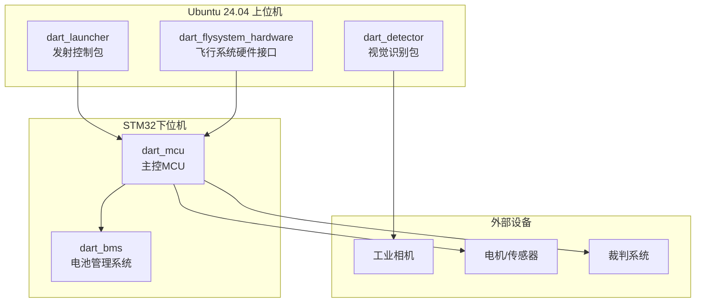
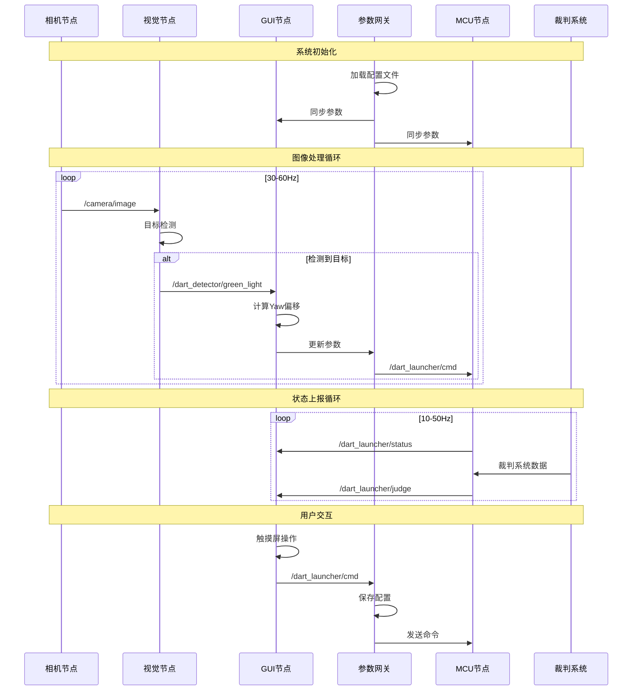
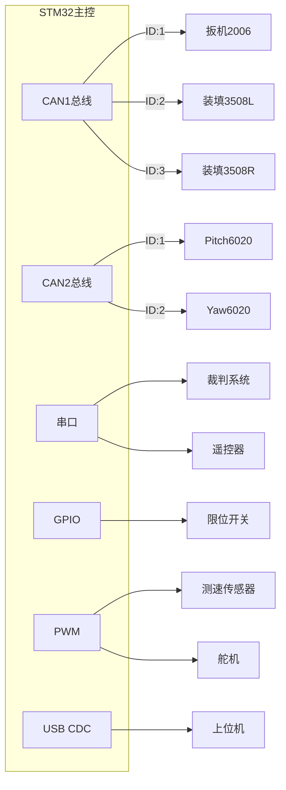

# 飞镖ROS2工作空间

[](LICENSE)
[](https://docs.ros.org/en/jazzy/)
[](https://ubuntu.com/)

## 项目简介

本仓库是飞镖机器人的**完整ROS2工作空间**，包含了飞镖发射系统的所有软硬件控制代码。系统采用上下位机架构：
- **上位机**: Ubuntu 24.04 + ROS2，负责视觉识别、发射控制、参数管理、GUI显示
- **下位机**: STM32微控制器 + Micro-ROS，负责电机控制、传感器读取、裁判系统通信

### 系统架构概览



## 快速开始

### 克隆仓库

```bash
git clone --recurse-submodules git@github.com:ChenYuWuAi/dart-ros2-workspace.git
cd dart-ros2-workspace
```

> ⚠️ **重要**: 必须使用 `--recurse-submodules` 选项来初始化所有子模块

### 安装依赖

```bash
# 安装ROS2依赖
rosdep update
rosdep install --from-paths src -i -y --rosdistro jazzy

# 安装额外依赖
sudo apt install libopencv-dev libgsl-dev
```

### 编译

```bash
colcon build --symlink-install
source install/setup.bash
```

### 运行

```bash
# 使用提供的启动脚本
./scripts/launch.sh

# 或直接使用ros2 launch
ros2 launch dart_launcher dart.launch.py
```

## 核心功能包

### 1. dart_detector - 视觉识别功能包

负责目标检测和图像处理：
- ✅ 绿灯目标检测（传统CV + 神经网络）
- ✅ 二维码扫描与参数导入
- ✅ 支持多种相机（大华工业相机、V4L2、RPi相机）
- ✅ OpenVINO神经网络加速

**通信接口**:
- 订阅: `/camera/image` (sensor_msgs/Image)
- 发布: `/dart_detector/green_light` (dart_msgs/GreenLight)

### 2. dart_launcher - 发射控制功能包

系统核心控制模块：
- ✅ LVGL图形界面 (触摸屏交互)
- ✅ 发射参数管理与协议存储
- ✅ 与MCU的实时通信
- ✅ 发射轨迹计算与优化
- ✅ 系统日志与状态监控
- ✅ 生命周期管理与故障恢复

**核心节点**:
- `NodeDartApp`: GUI主节点
- `NodeDartParamGateway`: 参数网关节点
- `NodeDartLogger`: 日志记录节点
- `NodeDartLauncherLifecycle`: 生命周期管理节点

### 3. dart_flysystem_hardware - 飞行系统硬件接口

提供ROS2 Control硬件抽象层：
- ✅ 电机执行器接口
- ✅ 编码器读取接口
- ✅ IMU数据获取接口
- ✅ PWM舵机控制接口

### 4. dart_mcu - 主控MCU固件

基于STM32F4的下位机控制程序：
- ✅ Micro-ROS集成（USB CDC通信）
- ✅ CAN总线电机控制（6020/3508/2006电机）
- ✅ 裁判系统串口通信
- ✅ 遥控器接收
- ✅ 限位开关与传感器读取
- ✅ 有限状态机管理

### 5. dart_bms - 电池管理系统

STM32电池管理固件：
- ✅ 电池状态监测
- ✅ 过充过放保护
- ✅ 温度监控

## 通信架构

### ROS2话题列表

| 话题名称 | 消息类型 | 方向 | 频率 | 说明 |
|---------|---------|------|------|------|
| `/camera/image` | sensor_msgs/Image | 相机→视觉 | 30-60Hz | 相机图像流 |
| `/dart_detector/green_light` | dart_msgs/GreenLight | 视觉→发射控制 | 30-60Hz | 绿灯检测结果 |
| `/dart_launcher/cmd` | std_msgs/Int32MultiArray | 上位机→MCU | 变化时 | 发射参数命令 |
| `/dart_launcher/status` | std_msgs/Int32MultiArray | MCU→上位机 | 10-50Hz | 系统状态 |
| `/dart_launcher/judge` | std_msgs/Int16MultiArray | MCU→上位机 | 10Hz | 裁判系统数据 |

### 完整通信时序图



## 数据结构

### 发射参数 (Int32MultiArray, 长度15)

| 索引 | 参数名 | 说明 |
|------|--------|------|
| 0 | primary_yaw | 发射目标主偏航角 |
| 1 | primary_pitch | 发射目标主俯仰角 |
| 2 | primary_force | 发射扳机主位置 |
| 3-6 | auxiliary_yaw_offsets | 副偏航角偏移量[4] |
| 7-10 | auxiliary_force_offsets | 副扳机位置偏移量[4] |
| 11 | sequence_offset | 发射起始序号 |
| 12-13 | last_param_update_time | 参数更新时间戳(ms) |
| 14 | dart_state | 系统状态码 |

### 系统状态码

- `100`: Boot - 启动中
- `101`: Protect - 保护模式
- `102`: Remote - 遥控模式
- `103-106`: Match - 比赛模式(Enter/Wait/Launch/Reload)
- `255`: Undefined - 未定义

### 裁判系统数据 (Int16MultiArray, 长度6)

| 索引 | 参数名 | 说明 |
|------|--------|------|
| 0 | dart_launch_opening_status | 发射架开启状态 |
| 1 | game_progress | 比赛进程 |
| 2 | dart_remaining_time | 剩余发射时间 |
| 3 | latest_launch_cmd_time | 最新发射指令时间 |
| 4 | stage_remain_time | 当前阶段剩余时间 |
| 5 | judge_online | 裁判系统在线状态 |

## 电气拓扑

详细的电气连接请参考 [飞镖架电气拓扑.md](飞镖架电气拓扑.md)



## 工作流程

本项目采用 **Github Pull Request** 工作流：

1. **Fork** 本仓库到你的账号
2. 创建功能分支: `git checkout -b feature/your-feature`
3. 提交更改: `git commit -am 'Add some feature'`
4. 推送分支: `git push origin feature/your-feature`
5. 向上游提交 **Pull Request**

## 调试与测试

### 查看系统状态

```bash
# 查看所有话题
ros2 topic list

# 查看节点列表
ros2 node list

# 监听话题数据
ros2 topic echo /dart_launcher/status

# 查看话题频率
ros2 topic hz /camera/image

# 使用rqt图形工具
rqt
```

### 视觉调试

```bash
# 查看相机图像
ros2 run rqt_image_view rqt_image_view

# 查看检测结果
ros2 topic echo /dart_detector/green_light
```

### 日志分析

```bash
# 查看ROS日志
cat $ROS_LOG_DIR/latest.log

# 使用提供的日志分析工具
python3 log_reader.py
```

## 开发环境

### 系统要求

- **操作系统**: Ubuntu 24.04 LTS
- **ROS2版本**: Jazzy
- **架构**: x86_64 (开发) / aarch64 (部署)
- **Python**: 3.10+
- **GCC**: 11.0+

### 交叉编译

```bash
# 使用提供的交叉编译脚本
./scripts/cross_compile.sh

# 或使用Docker
docker build -f Dockerfile -t dart-ros2-cross .
```

### STM32开发

```bash
# 安装ARM工具链
sudo apt install gcc-arm-none-eabi stlink-tools

# 打开STM32CubeMX工程
# dart_mcu: src/dart_mcu/dart_mcu.ioc
# dart_bms: src/dart_bms/dart_bms.ioc
```

## 配置管理

### 打击协议

打击协议存储为JSON格式，包含一组预设的发射参数。可以通过以下方式管理：

1. **GUI编辑器**: 在触摸屏上直接编辑
2. **手机APP**: 生成二维码，由后置相机扫描导入
3. **配置文件**: 直接编辑 `src/dart_launcher/config/` 下的JSON文件

协议示例：
```json
{
  "protocol_name": "target_1",
  "primary_yaw": 1500,
  "primary_pitch": 2000,
  "primary_force": 3000,
  "auxiliary_yaw_offsets": [0, 50, -50, 0],
  "auxiliary_force_offsets": [0, 100, -100, 0],
  "dart_selection": ["A", "B", "C", "D"],
  "auto_yaw_calibration": true
}
```

## 故障排查

### 常见问题

| 问题 | 可能原因 | 解决方案 |
|------|---------|---------|
| 视觉节点无图像 | 相机未连接/驱动问题 | 检查USB连接，确认驱动加载 |
| MCU通信失败 | 串口权限/Micro-ROS代理 | `sudo chmod 666 /dev/ttyACM0` |
| GUI界面不显示 | Framebuffer设备问题 | 检查 `/dev/fb0` 权限和配置 |
| 电机不响应 | CAN总线问题 | 检查接线和电源 |

详细故障排查请参考 [ARCHITECTURE.md](ARCHITECTURE.md#故障排查)

## 文档

- **[ARCHITECTURE.md](ARCHITECTURE.md)**: 详细的系统架构文档
  - 完整的目录结构说明
  - 各功能包详细介绍
  - 通信时序图和数据流
  - 开发部署指南
  
- **[飞镖架电气拓扑.md](飞镖架电气拓扑.md)**: 电气连接和状态机设计

- **各功能包README**: 
  - [dart_mcu/README.md](src/dart_mcu/micro_ros_stm32cubemx_utils/README.md)
  - [dart_bms/README.md](src/dart_bms/README.md)

## 许可证

- **dart_launcher**: Apache-2.0
- **dart_test**: MIT
- **其他包**: 参见各自的LICENSE文件

总体项目许可: 参见 [LICENSE](LICENSE) 文件

## 贡献者

感谢所有为本项目做出贡献的开发者！

## 联系方式

- **维护者**: ChenYu Wu
- **邮箱**: chengnangong@163.com
- **GitHub**: https://github.com/ChenYuWuAi/dart-ros2-workspace

---

**最后更新**: 2025-10-30  
**文档版本**: 2.0 - 全面更新架构说明
